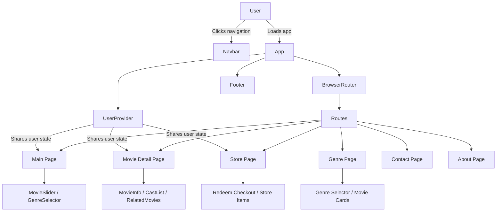

# Methodology

## a. Tools & Technologies

This project was built using the following tools and technologies:

- **React 19** for building the UI with reusable components.
- **Vite** as the development server and build tool.
- **Tailwind CSS v4** for styling and responsive layout.
- **React Router v7** for client-side navigation and route management.
- **Framer Motion** for animated page and component transitions.
- **React Icons** and **@boxicons/react** for iconography.
- **react-youtube** for embedding YouTube videos within the interface.
- **ESLint** with **Prettier** for code quality, linting, and formatting.
- **Git** for version control and project tracking.

## b. Use Case Diagram

### Main Actors

- **Guest / User**
- **System / App**

### Primary Actions

- Browse home page content
- View movie details
- Filter by genre
- Search or access movie pages
- Browse series
- View store and redeem offers
- Access contact and about pages
- Sign up / register user

### Use Case Diagram

```mermaid
%%{init: {'theme': 'base'}}%%
actor User
User --> (Browse Home Page)
User --> (View Movie Details)
User --> (Filter by Genre)
User --> (Browse Series)
User --> (Open Store)
User --> (Complete Redeem Checkout)
User --> (View Contact Page)
User --> (View About Page)
User --> (Sign Up)
```

## c. System Diagram

### Component Structure

The application is structured around React component pages and shared layout components.

- `src/App.jsx`
  - `Navbar.jsx`
  - `Routes` to page components:
    - `Main.jsx`
    - `Signup.jsx`
    - `MovieDetail.jsx`
    - `MoviesPage.jsx`
    - `SeriesPage.jsx`
    - `GenrePage.jsx`
    - `Store.jsx`
    - `Tasks.jsx`
    - `RedeemCheckout.jsx`
    - `Contact.jsx`
    - `AboutUs.jsx`
  - `Footer.jsx`
- `src/context/UserContext.jsx` provides shared user state across the app.
- `src/data/` holds static data files such as movies, products, and genres.

### Data Flow

- `App.jsx` wraps the entire app in `UserProvider`.
- `App.jsx` uses `BrowserRouter` and `Routes` to determine which page component renders.
- Page components receive props and query routing parameters from `react-router-dom`.
- Shared layout components like `Navbar` and `Footer` stay visible across routes.
- Movie and genre data are retrieved from local static data modules and passed down to child components.
- User actions (clicking cards, selecting genres, navigating pages) trigger route changes or local state updates.

### System Diagram



## d. Algorithms / Flow (Process)

### Slide Presentation: Application Flow

#### Slide 1: App Initialization

- User opens the website.
- `src/index.jsx` renders `<App />` inside `StrictMode`.
- `src/App.jsx` initializes `UserProvider` and `BrowserRouter`.
- `Navbar` and `Footer` are mounted outside route-specific content.

#### Slide 2: Route Selection

- `Routes` inside `App.jsx` checks the current URL path.
- The matching route renders one of the page components.
- Example paths:
  - `/` → `Main`
  - `/movie/:id` → `MovieDetail`
  - `/genre/:genreName` → `GenrePage`
  - `/store` → `Store`

#### Slide 3: Data Loading

- Static movie and series data are imported from `src/data/` modules.
- The page components use this data to display cards, lists, and details.
- `MovieDetail` uses the URL `:id` parameter to find a single movie record.
- `GenrePage` applies a genre filter to show only matching movies.

#### Slide 4: User Interaction

- User clicks a movie card or navigation link.
- `react-router-dom` updates the URL without a full page reload.
- The app renders the appropriate component for the new route.
- Local state and context may update as the user interacts with forms or filters.

#### Slide 5: Checkout and Redeem Flow

- User visits `/store` or `/redeem-checkout`.
- Redeem or checkout components display products and reward details.
- User confirms a selection and proceeds through the checkout UI.

#### Slide 6: Shared State and Context

- `UserContext` provides shared user data across the app.
- Pages can read or update context for sign-up, login state, or user preferences.
- Shared components like `Navbar` can show dynamic content based on context.

#### Slide 7: UI and Styling

- Tailwind CSS classes define responsive layout and styling.
- `Framer Motion` enhances transitions with animation.
- Icons and media components add visual appeal.

#### Slide 8: Build and Deployment

- `npm run dev` starts the Vite development server.
- `npm run build` generates optimized static assets.
- The app is ready for deployment as a static React site.

---

### Summary

This methodology document explains the tools used, the high-level actors and actions, the component structure, the data flow, and the step-by-step process of how the React app operates.

## Conclusion Script

[Slide: Conclusion]

This project successfully developed NaekWatch, a movie streaming platform that provides both free and premium content, along with a task-based reward system. The system allows users to watch movies, earn points, and redeem items.

The main objectives were achieved, as the platform supports streaming functionality, implements a reward system, and provides a user-friendly interface for managing movies and user activities.
